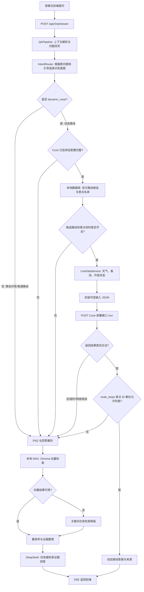

# 灵山胜境动态路线规划接入说明（供 DeepSeek 审查）

**文档日期**：2026-07-15  
**当前状态**：后端路由、Coze 调用、结果校验与本地降级逻辑已接入；需要使用真实前端请求完成一次端到端联调。  
**目标**：让简单景点问答继续走本地知识库和 DeepSeek；只有涉及路线、偏好、天气或客流等动态决策的问题才调用 Coze 工作流。

## 1. 设计边界

### 本地后端负责

- 识别问题意图，决定是否需要动态路线规划。
- 查询本地官方景点资料、官方路线候选。
- 生成实时上下文；当前 `LiveDataService` 使用 `mock` 演示数据，后续可替换为真实天气、客流和开放状态 Provider。
- 将可信数据封装后传给 Coze。
- 校验 Coze 返回的景点 ID，只允许官方景点。
- Coze 不可用、超时或返回异常时，降级回现有本地问答链路。

### Coze 工作流负责

- 只基于后端传入的游客偏好、官方路线候选和实时上下文，生成个性化路线建议。
- 不连接赛题资料库，也不自行检索或补充外部事实。
- 返回结构化的 `result_json`。

### DeepSeek 负责

- 为静态景点介绍、开放信息、文化讲解等问题，根据本地 RAG 检索结果组织自然语言答案。
- 作为 Coze 动态路线规划失败时的本地兜底回答能力。
- 不直接决定动态路线，不直接访问 Coze。

## 2. 整体链路图



该图的关键约束是：Coze 不能绕过本地官方数据，且不会成为单点故障。动态分支任何一步失败，都回到已经存在的本地 RAG + DeepSeek 链路。

## 3. 意图路由规则

入口在 `backend/app/services/qa/intent_router.py`，当前会发送一条 SSE `intent` 事件，供前端展示状态或埋点使用。

| 场景 | 识别结果 | 后续处理 |
| --- | --- | --- |
| 纯景点介绍、文化背景、设施、开放信息 | `static_qa` | 本地 RAG + DeepSeek |
| 只问已有官方路线，如“有哪些路线”“经典路线是什么” | `static_route` | 当前仍走本地问答链路 |
| 需要结合时长、同行人、节奏、天气、客流、拥挤程度等规划 | `dynamic_route` | 尝试调用 Coze |
| 引导选择处于路线模式，且含游览时长或避开拥挤偏好 | `dynamic_route` | 尝试调用 Coze |

当前动态关键词包含“推荐路线”“规划路线”“怎么逛”“避开人流”“天气”“客流”“拥挤”“实时”“亲子路线”“老人”“两小时”“半天”等。单个弱关键词置信度较低，多个动态词或携带路线引导偏好时置信度更高。

只有同时满足以下条件，才会真的进入 Coze：

1. 意图是 `dynamic_route`；
2. `COZE_ENABLED=true`，且 `COZE_RUN_URL`、`COZE_TOKEN` 都有效；
3. 请求中带有路线选择上下文，或用户问题具有“路线/线路/怎么逛/推荐”之一；
4. 本地能取到官方路线候选和景点资料。

## 4. 后端传给 Coze 的契约

后端调用 Coze 的部署接口：`POST {COZE_RUN_URL}`，请求头为：

```text
Authorization: Bearer {COZE_TOKEN}
Content-Type: application/json
```

请求体固定为五个字符串字段，每个 `*_json` 字段本身是 JSON 序列化后的字符串：

```json
{
  "question": "我带父母游览两小时，天气热，想少走路",
  "visitor_profile_json": "{...}",
  "route_candidates_json": "{...}",
  "live_context_json": "{...}",
  "allowed_attraction_ids_json": "[\"1\", \"2\", \"3\"]"
}
```

字段含义如下：

| 字段 | 来源 | 作用 |
| --- | --- | --- |
| `question` | 前端原始提问 | 保留游客的原始表达 |
| `visitor_profile_json` | 请求选择上下文与后端解析结果 | 同行人、时长、节奏、避拥挤等偏好 |
| `route_candidates_json` | 本地 `RouteRepository` 与景点资料 | 仅供选择的官方路线候选 |
| `live_context_json` | `LiveDataService` | 天气、客流、景点开放状态、时间戳、是否模拟数据 |
| `allowed_attraction_ids_json` | 本地官方景点记录 | Coze 可推荐景点的白名单 |

`live_context_json` 至少包含以下结构：

```json
{
  "is_mock": true,
  "source_label": "mock",
  "weather": {
    "condition": "晴",
    "temperature": "22-28°C",
    "suggestion": "适合户外与室内景点搭配游览"
  },
  "visitor_flow": {
    "level": "中等",
    "suggestion": "高峰景点建议错峰进入"
  },
  "attractions_status": [
    {
      "attraction_id": "1",
      "name": "示例景点",
      "status": "开放",
      "note": "当前为演示模拟数据"
    }
  ],
  "timestamp": "2026-07-15T10:00:00+08:00"
}
```

## 5. Coze 返回契约与后端校验

Coze 可以直接返回对象，也可以返回含 `result_json` 字段的对象；若 `result_json` 是字符串，后端会再解析一层 JSON。最终内容必须符合：

```json
{
  "answer": "给游客看的路线建议。若实时数据为模拟数据，必须在此明确说明。",
  "route_stops": [
    {
      "attraction_id": "1",
      "reason": "从官方候选路线中选择，且适合当前偏好"
    }
  ],
  "adjustments": [
    "根据天气、客流或开放状态作出的调整"
  ],
  "sources": [
    "官方路线候选",
    "实时上下文"
  ],
  "warning": "",
  "live_data_timestamp": "2026-07-15T10:00:00+08:00"
}
```

后端强制校验：

1. HTTP 调用必须成功，且响应可解析为 JSON；
2. `answer` 必须为非空字符串；
3. `route_stops`、`adjustments`、`sources` 必须是数组；
4. 每个非空 `route_stops[].attraction_id` 必须属于 `allowed_attraction_ids_json`；
5. 任意校验失败、超时或网络错误都不把异常直接展示给游客，而是回退至本地问答。

> 审查建议：可以进一步收紧第 4 条，要求 `route_stops` 不能为空，并要求每个停靠点都必须同时含有非空 `attraction_id` 和 `reason`。目前实现只校验“已给出的非空 ID 不越界”。

## 6. SSE 与前端表现

接口仍是 `POST /api/chat/stream`，前端无需新建另一套聊天接口。动态路线命中时，流中会额外出现：

```text
event: intent
data: {"intent":"dynamic_route","confidence":0.85,"matched_keywords":["推荐路线","两小时"]}

event: status
data: {"text":"正在规划个性化路线..."}
```

成功后，仍使用既有 `text`、`sources`、`done` 事件完成回答渲染；内部命中标识为 `dynamic_route_coze`，来源标识为 `coze_dynamic_route`。因此现有前端即便暂时忽略 `intent` 事件，也能显示最终答案；建议后续把 `status` 文案用于加载态，把 `sources` 用于“官方路线候选 / 实时上下文”来源展示。

## 7. 配置项

配置定义在 `backend/app/core/config.py`，环境变量示例在 `backend/.env.example`：

```dotenv
LIVE_DATA_PROVIDER=mock
LIVE_DATA_MOCK_WEATHER=晴
LIVE_DATA_MOCK_TEMPERATURE=22-28°C
LIVE_DATA_MOCK_CROWD_LEVEL=中等

COZE_ENABLED=true
COZE_RUN_URL=https://你的部署域名.coze.site/run
COZE_TOKEN=你的部署接口令牌
COZE_TIMEOUT_SECONDS=12
```

注意：这里接的是 `code.coze.cn` 生成式工作流部署后的 API 域名，而不是低代码 Workflow ID。调用依赖的是 `/run` 地址和 Bearer Token；令牌只能保存在 `backend/.env`，不能提交到 Git 或放进前端代码。

## 8. 降级策略

| 失败或不满足条件 | 系统行为 |
| --- | --- |
| 未开启 Coze、URL/Token 缺失 | 不调用 Coze，走本地问答 |
| 不属于动态路线问题 | 走本地问答 |
| 官方景点或路线候选为空 | 走本地问答 |
| Coze 超时、401、500、网络失败 | 记录后端异常日志，走本地问答 |
| Coze 返回非 JSON、字段不合规、无 `answer` | 走本地问答 |
| Coze 返回未授权景点 ID | 拒绝该结果，走本地问答 |

本地问答链路顺序仍保持：FAQ / 缓存 -> Chroma 向量检索 -> 关键词仓库检索降级 -> 重排序和证据整理 -> DeepSeek 生成回答。

## 9. 现阶段限制与后续建议

1. 实时数据目前是可配置的模拟数据，`is_mock=true` 时 Coze 必须在 `answer` 中明确标注“演示模拟数据”。接入真实天气和客流 API 时，只需替换 `LiveDataService` 的数据来源，返回结构保持不变。
2. Coze 当前只返回文本答案和路线停靠点，前端尚未把 `route_stops` 渲染为可点击路线卡片。可以在 SSE 中新增一个结构化 `route_plan` 事件，再由前端绘制路线。
3. 动态分支不会流式输出 Coze 的生成过程；会先显示“正在规划个性化路线...”，待 Coze 返回后一次性输出最终建议。
4. 应增加真实 API 冒烟测试：从浏览器提一条“带父母两小时、避开拥挤”的问题，确认日志命中 `dynamic_route_coze`；再临时关闭 Coze 或填入错误 Token，确认能正常降级为本地回答。

## 10. 请 DeepSeek 重点审查的项目

1. 意图关键词及阈值是否足以避免“普通路线介绍”误走 Coze；
2. `visitor_profile_json` 是否应补充年龄段、无障碍需求、出发时间、预算等字段；
3. `route_candidates_json` 是否需要显式包含每站预计停留时长、步行距离、排序约束；
4. 是否将 Coze 输出校验升级为 Pydantic Schema，并严格校验 `route_stops` 的每个字段；
5. 是否在动态回答中把 `route_stops` 和 `adjustments` 作为独立 SSE 结构化事件返回前端；
6. 真实天气、客流、开放状态接入后，缓存时长、数据源失败策略和数据更新时间展示应如何定义；
7. 是否需要记录每次动态路线调用的请求摘要、耗时、降级原因与结果，供管理端统计。

## 11. 当前代码位置

| 职责 | 文件 |
| --- | --- |
| API 与依赖装配 | `backend/app/api/chat.py` |
| 动态分支、请求组装、结果校验、降级 | `backend/app/services/qa/pipeline.py` |
| 问题意图识别 | `backend/app/services/qa/intent_router.py` |
| Coze HTTP 客户端 | `backend/app/services/coze/client.py` |
| 实时上下文模型 | `backend/app/schemas/live_data.py` |
| 模拟实时数据 Provider | `backend/app/services/live_data/service.py` |
| 环境配置 | `backend/app/core/config.py`、`backend/.env.example` |

