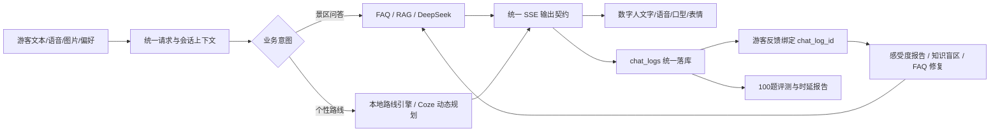

# 中国软件杯 A5 作品一次性整改与补强实施方案

**项目**：灵山胜境景区 AI 数字人导览系统  
**方案日期**：2026-07-16  
**方案性质**：实施前技术方案，不包含本轮代码修改  
**目标**：以一次完整的集成迭代解决当前影响赛题硬要求、业务闭环、稳定性和答辩可信度的问题。

---

## 1. 方案结论

当前项目不需要推倒重来。应继续保留现有的 `FastAPI + Vue 3 + SQLite + Chroma + DeepSeek/Qwen/CosyVoice + Three.js/VRM` 架构，将整改收敛到一条统一业务主线：



本次整改的核心不是增加页面，而是确保：

1. 每个页面展示的结果都来自真实接口。
2. 每条回答都能落库并返回 `chat_log_id`。
3. 每条反馈都能追溯到具体问题、回答、来源和命中链路。
4. 每个外部模型都具备强校验、超时、降级和可观测状态。
5. 赛题准确率和语音时延由当前版本的自动化报告证明。

## 2. 当前基线与新增扫描发现

### 2.1 已确认基线

- 前端生产构建已通过。
- 后端当前测试结果为 `93 passed, 2 failed`，两个失败均由后台鉴权接入后测试未同步导致。
- 后端 `/api/recommend/` 可以返回真实数据库路线，但游客路线页仍读取 `PRESET_ROUTES`。
- 运行时 ASR 实例为 `QwenASRService`，LLM、Vision、ASR、TTS 和 Coze 配置均存在。
- 现有最新端到端报告 `eval/reports/e2e_eval_b2_sampled_real.json` 为 2026-06-19 生成，100 题全部受到 502 影响，报告准确率为 0，不能作为当前作品证明。
- 前端没有 Vitest、Playwright 或其他自动化测试依赖。

### 2.2 本次代码扫描新增发现

| 编号 | 新发现 | 出现位置 | 直接影响 |
|---|---|---|---|
| F1 | 普通问答、动态路线等分支落库后均丢弃 `ChatLog` 返回值，`done` 事件为空 | `backend/app/services/qa/pipeline.py:353`、`:506`、`:607` | 前端无法获得日志 ID，反馈不能形成闭环 |
| F2 | 前端虽接收 `done.chat_log_id`，提交反馈时没有传该字段 | `frontend/src/stores/chat.js:206`、`:244` | 感受度报告只能统计总量，不能定位错误回答 |
| F3 | `/api/insights/*` 的运营分析 GET 接口未要求管理员鉴权 | `backend/app/api/insights.py:78-205` | 管理后台数据实际可公开访问 |
| F4 | Coze 响应以 `dict/list` 手工检查，允许空 `route_stops`、空停靠理由 | `backend/app/services/coze/client.py`、`pipeline.py:530` 附近 | 外部工作流返回不完整时仍可能被当成成功结果 |
| F5 | 动态路线和流式问答按句创建多个 TTS task，缺少并发上限 | `backend/app/services/qa/pipeline.py` 的 `audio_tasks` 逻辑 | 长回答可能瞬间触发多次 TTS，导致 429、乱序或延迟波动 |
| F6 | `/health` 永远返回 ok，不检查数据库、RAG 索引或模型配置 | `backend/main.py` | 现场显示“服务正常”但核心依赖可能不可用 |
| F7 | 应用启动同步预加载 embedding、reranker 和 FAQ 索引，没有启动阶段状态输出 | `backend/main.py` lifespan | 首次启动可能长时间无反馈，现场容易误判为卡死 |
| F8 | 负面反馈按钮只提交 rating，没有原因选择；报告多数会归入“其他建议” | `frontend/src/views/tourist/ChatView.vue`、`frontend/src/stores/chat.js` | 感受度报告缺少可行动建议，赛题后台要求完成度不足 |
| F9 | `.env` 中存在重复 `ASR_PROVIDER`，依赖“最后一项覆盖” | `backend/.env` | 不同启动方式可能产生配置理解偏差 |
| F10 | 仓库中存在 0%、64%、90% 等互相冲突的准确率描述 | `eval/reports` 与多份 `docs` 报告 | 评委无法判断哪个结果代表当前版本 |

## 3. 技术决策与边界

### 3.1 采用的成熟技术

| 场景 | 采用方案 | 选择理由 |
|---|---|---|
| API 输入与 Coze 输出 | Pydantic v2 强类型 Schema + `model_validator` | 对外部工作流输出做一次性完整校验，避免散落的手工判断 |
| 外部模型调用 | 复用 `httpx.AsyncClient`，配置 connect/read/write/pool 分阶段超时和连接池上限 | HTTPX 官方支持，减少重复建连和无边界等待 |
| 前后端真实流程验收 | Playwright Chromium 核心 E2E + APIRequestContext | 可同时启动前后端，验证用户可见行为和数据库后置结果 |
| 后端回归 | 继续使用现有 pytest/TestClient/MockTransport | 当前体系成熟且覆盖较多，无需更换框架 |
| 运行状态 | FastAPI lifespan + `/health`、`/ready` 分离 | `health` 判断进程存活，`ready` 判断是否具备比赛演示条件 |
| 比赛指标 | 现有 `eval` 框架升级为唯一权威报告 | 保留已有资产，解决结果冲突而不是另建评测体系 |

实现参考：

- Pydantic validators：<https://docs.pydantic.dev/latest/concepts/validators/>
- HTTPX 超时：<https://www.python-httpx.org/advanced/timeouts/>
- HTTPX 连接池限制：<https://www.python-httpx.org/advanced/resource-limits/>
- Playwright 多 Web Server：<https://playwright.dev/docs/test-webserver>
- Playwright API 测试：<https://playwright.dev/docs/api-testing>
- FastAPI lifespan：<https://fastapi.tiangolo.com/advanced/events/>

### 3.2 明确不做的改动

- 不拆微服务，不引入消息队列、Kubernetes 或复杂服务治理。
- 不替换现有 Vue、FastAPI、SQLite、Chroma 和数字人引擎。
- 不为了“技术先进”改写已可用的 RAG、FAQ 或头像配置模块。
- 不接入来源不明的客流数据；没有真实接口时继续使用模拟数据并醒目标注。
- 不做全站重新设计，仅修改完成业务闭环所需的交互状态和信息展示。
- 不为了减少构建包体积而牺牲数字人效果；包体优化仅在核心功能全绿后进行。

## 4. 一次性整改的目标契约

### 4.1 统一 SSE `done` 事件

所有回答分支必须先保存日志，再返回同样的数据结构：

```json
{
  "type": "done",
  "data": {
    "chat_log_id": 128,
    "hit_level": "rag",
    "total_ms": 3260,
    "degraded": false,
    "provider": "deepseek"
  }
}
```

约束：

- FAQ、缓存、RAG、RAG 降级、Coze 动态路线、拒答都必须返回 `chat_log_id`。
- `degraded=true` 时必须同时返回可读的降级类型，例如 `llm_timeout`、`coze_timeout`、`tts_unavailable`。
- `done` 只能在数据库提交成功后发送；日志失败时返回明确错误，不允许伪装完成。

### 4.2 结构化动态路线事件

Coze 成功后除文字外增加 `route_plan` SSE：

```json
{
  "type": "route_plan",
  "data": {
    "mode": "coze_dynamic",
    "is_mock_live_data": true,
    "stops": [
      {"attraction_id": "13", "name": "灵山大佛", "reason": "适合长者且步行压力较低"}
    ],
    "adjustments": ["避开当前高峰区域"],
    "warning": "天气与客流为演示模拟数据",
    "live_data_timestamp": "2026-07-16T10:00:00+08:00"
  }
}
```

约束：

- `stops` 至少 1 项。
- 每个 stop 的 `attraction_id`、`name`、`reason` 均不能为空。
- `attraction_id` 必须属于本地白名单；`name` 必须以本地数据库名称覆盖外部返回值。
- 模拟实时数据必须在数据和页面上同时标记。

### 4.3 游客反馈契约

真实游客反馈不再允许缺少 `chat_log_id`：

```json
{
  "chat_log_id": 128,
  "session_id": "visitor-xxx",
  "rating": "negative",
  "reason_code": "accuracy",
  "comment": "大佛高度回答不准确"
}
```

约束：

- `positive` 可不填原因；`negative` 必须选择原因。
- 同一 `chat_log_id` 重复提交应更新原反馈，保持幂等。
- 后端校验 `chat_log.session_id == payload.session_id`。
- 演示种子数据保留 `chat_log_id = null`，但不能通过游客反馈 API 创建这种记录。

## 5. 分阶段实施方案

## 阶段 S0：冻结基线与建立唯一验收入口

### 修改范围

- 新增 `scripts/competition_check.ps1`。
- 新增 `docs/competition-baseline.md` 或在最终报告中生成基线区块。
- 不修改业务逻辑。

### 执行动作

1. 记录 Git commit/工作区快照、模型名、知识库条数、Chroma chunk 数和环境模式。
2. 预检脚本按顺序执行：
   - 后端 pytest；
   - 前端生产构建；
   - API 健康与就绪检查；
   - Playwright 核心流程；
   - 100 题评测；
   - 语音样本评测。
3. 外部网络测试和纯离线测试分开输出，不能混为一个通过状态。

### 验收标准

- 脚本在任一关键检查失败时返回非 0。
- 报告包含执行时间、版本、环境、测试数量和失败原因。
- 不再人工复制多个报告中的数字作为“当前结果”。

## 阶段 S1：统一问答日志、SSE 与反馈闭环

### 修改文件

- `backend/app/services/qa/pipeline.py`
- `backend/app/repositories/chat_log.py`
- `backend/app/schemas/chat.py`
- `backend/app/schemas/experience.py`
- `backend/app/api/insights.py`
- `frontend/src/stores/chat.js`
- `frontend/src/views/tourist/ChatView.vue`
- 对应 pytest 文件

### 具体改法

1. 抽取 `QAPipeline._persist_and_done(...)`，统一调用 `chat_log_repository.create()`，保存返回的 `ChatLog`。
2. FAQ、缓存、RAG、动态路线、拒答等分支全部通过该方法结束，禁止直接 `yield done {}`。
3. 前端把 `done.chat_log_id` 写入当前 assistant message。
4. `submitFeedback()` 必须传 `message.chatLogId`；ID 缺失时禁用按钮并显示“回答记录尚未完成”。
5. 点“需改进”后展开原因选择：回答不准确、内容不详细、推荐不符合、等待过久、其他。
6. 后端将游客端 `FeedbackCreate.chat_log_id` 改为必填；演示数据由 bootstrap 直接写库，不走该 API。

### 自动化测试

- 每一种 `hit_level` 都断言 `done.data.chat_log_id > 0`。
- 动态路线和普通问答均能通过日志 ID提交反馈。
- session 不匹配返回 404/403。
- 同一日志二次反馈更新原记录，不增加重复行。
- 负面反馈无 `reason_code` 返回 422。

### 验收标准

- 页面上任一完成回答都能点反馈。
- 数据库中的真实反馈 100% 关联 `chat_logs.id`。
- 后台可从反馈反查问题、回答、来源、命中层级和耗时。

## 阶段 S2：路线页面接入真实推荐接口

### 修改文件

- `frontend/src/views/tourist/RouteView.vue`
- `frontend/src/api/recommend.js`
- `frontend/src/stores/interaction.js`（如需复用已有偏好）
- `backend/app/schemas/recommend.py`
- `backend/app/services/recommend/engine.py`
- `backend/app/api/recommend.py`
- 新增路线相关前端 E2E

### 具体改法

1. 将 `PRESET_ROUTES` 改名为 `FALLBACK_ROUTES`，只在接口失败时使用，并显示“本地备选”。
2. 增加轻量偏好表单：兴趣、同行人、可用时长、避开拥挤。
3. 页面提交后调用 `fetchRecommendations()`；状态分为 loading、success、fallback、error。
4. 以接口 `routes` 为唯一正式展示数据，渲染 `reason`、`route_plan`、`guide_points`、`experiences`、`source`。
5. 后端保留现有 DB 驱动推荐，不引入新的推荐框架；仅补充输入标准化与无候选时的明确响应。
6. 推荐成功继续 upsert `VisitorProfile`，形成个性化数据沉淀。

### 自动化测试

- Playwright 监听并断言页面发出 `POST /api/recommend/`。
- “亲子 4 小时”和“历史文化 6 小时”至少在路线、推荐理由或讲解重点上存在差异。
- 接口断开时页面明确标记 fallback，不能显示为“AI 个性化推荐”。
- 后端无 `session_id` 返回 422。

### 验收标准

- 删除网络请求后页面无法伪装成个性化成功。
- 正常路径的全部路线卡都可追溯到数据库 source。
- 评委可以在 30 秒内完成一次偏好输入并看到结果变化。

## 阶段 S3：强化 Coze 动态路线契约与降级

### 修改文件

- 新增 `backend/app/schemas/coze.py`
- `backend/app/services/coze/client.py`
- `backend/app/services/qa/pipeline.py`
- `backend/app/api/chat.py`
- `backend/app/tests/test_coze_client.py`
- `backend/app/tests/test_pipeline.py`
- 前端聊天/路线卡渲染

### 具体改法

1. 定义 `CozeRouteStop`、`CozeRoutePlanResponse` Pydantic 模型。
2. 使用 `model_validator` 强制：非空 answer、至少一个 stop、stop 必须有 ID 和 reason。
3. 白名单校验后，用本地数据库补全/覆盖景点名称，禁止信任外部名称。
4. 把 Coze client 变为 lifespan 管理的共享 `httpx.AsyncClient`，设置：
   - connect timeout：3 秒；
   - read timeout：按配置且不超过比赛允许等待；
   - write/pool timeout：3 秒；
   - max connections：5；
   - keep-alive connections：2。
5. 仅对连接失败、502/503、限流做最多一次短退避重试；400/401/422 不重试。
6. 失败后返回本地路线推荐，而不是重新进入无关的普通 RAG 文本回答。
7. 输出结构化 `route_plan` 事件和统一 `done` 元数据。

### 自动化测试

- 合法、非 JSON、空 answer、空 stops、缺 reason、越权 ID、401、429、超时共 8 类测试。
- 错误 Token 时自动降级到本地路线，且总响应不超过设定上限。
- 模拟数据结果必须携带 `is_mock_live_data=true`。

### 验收标准

- Coze 成功结果可渲染为路线卡。
- 关闭 Coze 后仍能得到本地个性化路线。
- 页面不会展示未经本地数据库授权的景点。

## 阶段 S4：语音链路、TTS 并发与运行就绪

### 修改文件

- `backend/app/core/config.py`
- `backend/app/api/voice.py`
- `backend/app/services/asr/qwen.py`
- `backend/app/services/tts/bailian.py`
- `backend/app/services/qa/pipeline.py`
- `backend/main.py`
- `frontend/src/stores/chat.js`
- `frontend/src/views/tourist/ChatView.vue`
- 新增 `eval/assets/voice/` 与语音评测脚本

### 具体改法

1. 删除重复 `ASR_PROVIDER`，`.env.example` 与真实 `.env` 保持同一键结构。
2. 在 Settings 中增加比赛模式配置校验：provider 非 stub 时，对应 key/model/base_url 必须完整；缺失时 `/ready` 返回失败。
3. 保留 `/health` 作为进程存活检查；新增 `/ready`，检查：
   - 数据库可读写；
   - KnowledgeChunk 与 Chroma collection 非空且数量合理；
   - ASR/LLM/Vision/TTS provider 配置完整；
   - 数字人 active config 存在；
   - Coze 启用时 URL/token 完整。
4. 将无限制 `audio_tasks` 改为有序、有限并发的 TTS 协调器：
   - 第一段立即合成，优先保证首段播放；
   - 后续最多 2 个并发；
   - 按句序号播放，失败只降级对应句；
   - 队列长度设置上限，防止长答案打爆 provider。
5. `done` 中返回总耗时和 degraded；语音评测脚本记录 ASR、首文字、首音频、总完成时间。
6. 准备 5 条真实语音样本：普通话、高频景区专名、噪声、短问题、长问题。

### 自动化与实测

- ASR API：空音频、超限音频、provider 异常、合法音频。
- TTS：分句有序、并发不超过 2、某句失败能继续、浏览器降级标识正确。
- `/ready`：依赖正常返回 200，关键配置缺失返回 503 和具体失败项。
- 语音实测分别统计 FAQ 和 RAG 场景。

### 验收标准

- 5 条语音均可完成“录音 -> 转写 -> 回答 -> 播报”。
- FAQ 与 RAG 分开输出 P50/P95；正式报告以赛题要求的小于 5 秒为门槛。
- 任一云服务断开时页面不崩溃、不无限等待，并明确显示降级来源。

## 阶段 S5：后台鉴权与感受度报告可信化

### 修改文件

- `backend/app/api/auth.py`
- `backend/app/api/insights.py`
- `backend/app/core/config.py`
- `frontend/src/api/http.js`
- `frontend/src/views/admin/ExperienceReport.vue`
- 管理后台与 insights 测试

### 具体改法

1. 保留现有单管理员 HMAC token，不为比赛引入完整用户系统。
2. 增加 `ADMIN_TOKEN_TTL_SECONDS`，校验 token 中时间戳；默认建议 8 小时。
3. `ADMIN_PASSWORD` 和 `ADMIN_TOKEN_SECRET` 在 competition 环境不得使用代码默认值。
4. `/api/insights/feedback` 保持游客公开可写；所有运营 GET 接口增加 `Depends(require_admin_token)`。
5. Axios 收到 401 后清除 token 并跳转登录页，保留 redirect。
6. 感受度报告增加样本阈值：真实反馈少于 20 条时显示“样本不足，仅供趋势观察”。
7. 报告增加可行动项：负面原因 -> 具体问答 -> 来源/命中层级 -> 处理状态。

### 自动化测试

- 后台未认证 GET 为 401，认证后为 200。
- 游客 feedback 无 token 仍可提交。
- token 过期返回 401。
- 修复当前 `test_blind_spot_admin.py`，保留未认证拒绝测试，不移除鉴权。

### 验收标准

- 后端 pytest 全部通过。
- 浏览器清空 localStorage 后无法读取任何运营分析接口。
- 报告不把 1 条反馈的 100% 满意度包装成可靠结论。

## 阶段 S6：建立唯一权威评测与浏览器闭环测试

### 修改文件

- `eval/scripts/run_e2e_chat_eval.py`
- `eval/scripts/e2e_eval_core.py`
- `eval/testset/e2e_qa_100.json`
- 新增 `eval/testset/route_personalization_20.json`
- 新增 `eval/scripts/run_voice_eval.py`
- 新增 `frontend/playwright.config.js`
- 新增 `frontend/e2e/*.spec.js`
- `frontend/package.json`

### 具体改法

1. 建立唯一正式目录：`eval/reports/current/`，每次正式评测覆盖前先归档旧结果。
2. 正式报告必须包含：Git 标识、配置摘要、模型、知识库版本、测试集哈希、开始/结束时间。
3. 100 题评测保留原始逐题结果，报告同时输出：
   - 准确率；
   - evidence rate；
   - source hit rate；
   - refusal pass rate；
   - first text P50/P95；
   - total P50/P95；
   - provider/HTTP 失败数量。
4. 新增 20 条路线个性化测试，检查不同偏好是否导致合理差异，而不是只做关键词命中。
5. Playwright 只覆盖 5 条比赛关键流程：
   - 文本问答与来源引用；
   - 路线页面真实推荐；
   - 动态路线失败后本地降级；
   - 反馈绑定日志并进入后台；
   - 管理员登录与运营报告鉴权。
6. Playwright 使用两个 `webServer` 启动前后端，使用 APIRequestContext 验证数据库后置结果；只安装 Chromium，控制新增成本。

### 正式门槛

- 后端 pytest：0 failed。
- 前端生产构建：成功。
- Playwright 5 条核心流程：全部通过。
- 100 题事实问答准确率：`>= 90%`。
- evidence rate：目标 `100%`；无法回答题必须正确拒答。
- 路线 20 题：业务规则通过率 `>= 90%`。
- 语音问答：按赛题要求验证小于 5 秒并保留原始数据。
- 任何 502、401、超时都必须计入失败，不允许从分母删除。

## 阶段 S7：演示固化与材料同步

### 修改范围

- 新增 `docs/competition-demo-runbook.md`。
- 更新 PPT、部署手册、设计文档中的指标页。
- 不再修改业务架构。

### 具体改法

1. 固化 7 分钟演示：可信问答 -> 语音数字人 -> 个性路线 -> 反馈闭环 -> 后台报告 -> 硬指标。
2. 准备成功路径和降级路径各一条，避免现场网络异常无内容可讲。
3. 所有“已完成”“90%”“小于 5 秒”必须链接到 `eval/reports/current/`。
4. 模拟天气、客流和演示反馈必须在画面和讲稿中标注。
5. 演示前运行 `competition_check.ps1`，只在全部硬门槛通过后录制最终视频。

### 验收标准

- 同一台答辩电脑连续完整演示 3 次无崩溃。
- 断网或任一 provider 不可用时，文字问答和本地路线仍可演示。
- PPT、视频、代码和评测报告中的数字完全一致。

## 6. 实施顺序与依赖

| 顺序 | 阶段 | 依赖 | 建议工作量 | 是否阻塞提交 |
|---|---|---|---:|---|
| 1 | S0 基线与预检入口 | 无 | 0.5 人日 | 是 |
| 2 | S1 日志/SSE/反馈契约 | S0 | 1 人日 | 是 |
| 3 | S2 真实路线页面 | S1 | 1 人日 | 是 |
| 4 | S3 Coze 动态路线 | S1、S2 | 1 人日 | 是 |
| 5 | S4 语音与就绪状态 | S1 | 1-1.5 人日 | 是 |
| 6 | S5 鉴权与报告 | S1 | 0.5-1 人日 | 是 |
| 7 | S6 正式评测与 E2E | S2-S5 | 1.5 人日 | 是 |
| 8 | S7 演示与材料同步 | S6 | 0.5 人日 | 是 |

推荐总投入约 7 人日。多人并行时，S2、S4、S5 可以在 S1 契约冻结后并行，但 S6 必须最后统一执行。

## 7. 防止无效改动的审查规则

每项改动合入前必须回答以下问题：

1. 它对应哪一条 A5 赛题要求？
2. 它修复了哪个可复现问题？
3. 它是否有自动化或现场验收标准？
4. 它是否改变现有接口；若改变，前后端和评测是否同步？
5. 删除该改动后，评委是否能看出差异？

以下类型直接拒绝进入本轮：

- 仅改变颜色、阴影、动画但不改善硬要求的 UI 改动。
- 新增没有真实数据和调用链的按钮、图表或“AI 功能”。
- 重复建设新的 RAG、数据库、登录系统或数字人框架。
- 只修改说明文档、但代码和验收结果不变的“达标声明”。
- 为提高评测数字而删除失败题、忽略 HTTP 错误或缩小分母。

## 8. 最终 Definition of Done

只有同时满足以下条件，才可以声明“当前作品已满足 A5 硬性要求”：

- [ ] 路线页真实调用后端并产生可差异化结果。
- [ ] 所有回答均返回 `chat_log_id`，游客真实反馈全部可追溯。
- [ ] Coze 成功、异常、超时和越权返回均有测试与降级。
- [ ] ASR、LLM、TTS、数字人口型完成真实语音闭环。
- [ ] `/ready` 能真实反映数据库、知识库和 provider 状态。
- [ ] 后台运营数据全部受鉴权保护，游客反馈接口仍可公开使用。
- [ ] 后端 pytest 为 0 failed，前端生产构建成功。
- [ ] Playwright 五条比赛核心路径全部通过。
- [ ] 当前版本 100 题准确率达到 90% 以上。
- [ ] 当前版本语音时延达到赛题要求，原始报告可复验。
- [ ] 模拟数据、演示数据、真实数据均有明确标识。
- [ ] 7 分钟演示连续执行三次无崩溃，断网时存在可解释降级。

## 9. 实施建议

建议将本方案作为一个完整整改分支执行，但拆成可回滚的小批次：先冻结契约和测试，再改路线、Coze、语音、鉴权，最后统一跑评测。不要一边修改接口一边录视频，也不要在 100 题评测完成前继续写“准确率已达 90%”的材料。

本方案实施后的核心竞争点应集中为三句话：

1. **可信**：景区回答基于本地资料并提供证据，100 题评测可复验。
2. **可用**：游客可通过文字、语音和图片与数字人交互，并获得真实个性路线。
3. **可运营**：每条反馈能定位到具体回答并进入知识修复闭环。
