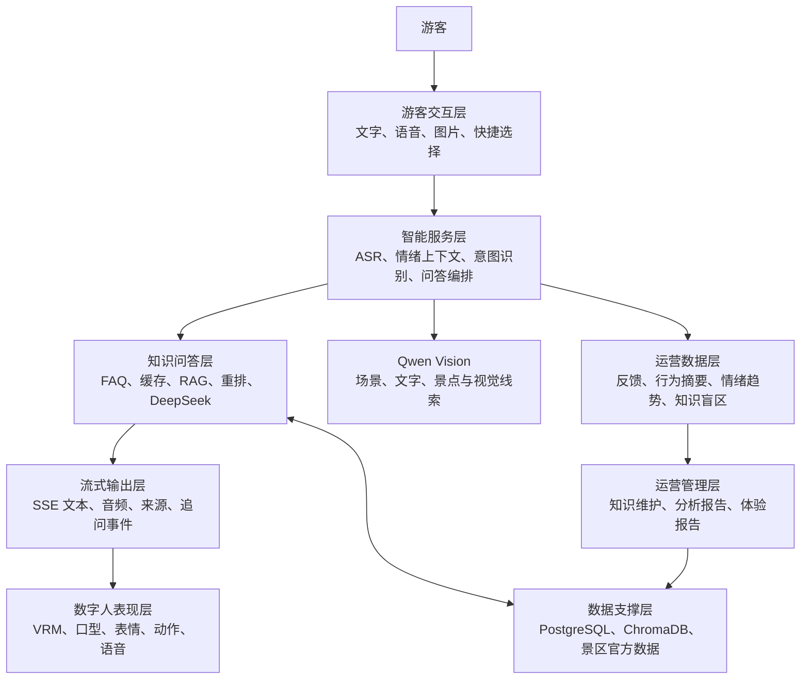
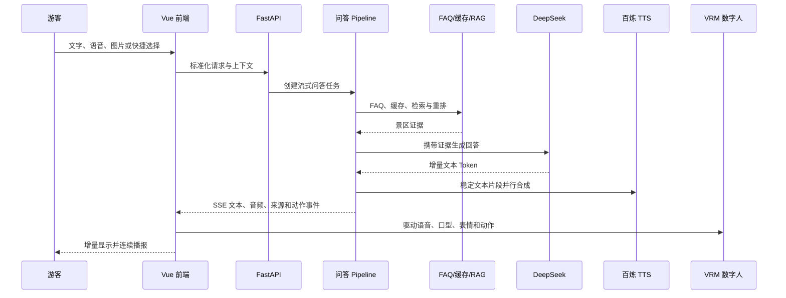
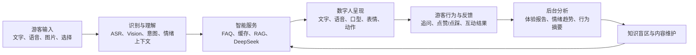

# 景区 AI 数字人智能导览系统作品说明文档

## 文档说明

本文面向软件杯评委、答辩专家及项目指导人员，用于系统说明作品的需求背景、功能架构、技术选型、实现方案、创新点、测试情况和团队分工。文档内容完全依据当前代码库、配置文件和 `docs/codebase/` 中已经核验的代码库知识文档编写，不引用外部材料，不将预留接口描述为已完成功能。

当前作品定位为比赛演示系统。演示环境已启用 DeepSeek LLM、百炼 TTS、百炼 ASR、Qwen Vision、OpenWeatherMap 和浏览器语音；后端景区综合实时数据仍使用模拟数据，Coze 动态路线工作流暂未启用。

---

## 1. 作品概述

本作品是一套面向景区游客的 AI 数字人智能导览系统。系统以景区官方资料和结构化知识数据为基础，将大语言模型、检索增强生成、语音识别、语音合成、拍照识景、情绪分析和三维数字人表达整合到统一交互链路中，为游客提供自然、直观且具有陪伴感的导览体验。

游客可以通过文字、语音、图片或快捷选项发起需求，系统对输入进行识别与理解，结合 FAQ、缓存、景区知识库和游客上下文形成回答，再通过流式文字、语音、口型、表情和动作进行同步呈现。除智能问答外，游客端还提供景区探索、路线推荐和互动问答等服务；管理端则承担知识管理、游客反馈、情绪趋势、体验报告和知识盲区分析等职责。

作品的核心并非单次问答，而是建立“游客交互—智能服务—体验记录—运营分析—知识改进—再次服务”的持续闭环，使数字人既能完成即时导览，也能为后续景区服务优化提供依据。

### 1.1 建设目标

1. 降低游客获取景区信息的操作门槛，使其能够通过自然语言、语音和图片完成咨询。
2. 基于景区官方资料生成有依据的回答，降低大语言模型脱离景区事实自由生成的风险。
3. 通过流式文字和流式语音缩短等待时间，改善网络不稳定情况下的交互连续性。
4. 通过数字人的口型、表情和动作增强表达效果，使导览从“信息查询”升级为“陪伴式讲解”。
5. 通过游客反馈、行为摘要、情绪趋势和知识盲区形成管理闭环，为知识库维护和服务优化提供依据。

### 1.2 当前演示边界

- 作品用于比赛演示，不以当前状态直接承担公网生产系统的安全和高可用要求。
- 已真实接入 DeepSeek LLM、百炼 ASR、百炼 TTS、Qwen Vision、OpenWeatherMap 和浏览器语音。
- Coze 路线规划属于可扩展接口，当前未启用。
- 后端实时景区数据服务中的天气、客流和景点开放状态目前为模拟数据；其中 OpenWeatherMap 前端天气能力已真实启用，两者不能混同。
- 用于后台统计、反馈、画像和知识改进的数据允许持久化；其他会话级临时数据应在游客退出时删除。公开 ASR 临时音频的自动清理仍是待完善项。

---

## 2. 需求分析

### 2.1 业务背景与主要问题

传统景区导览通常依赖固定导览牌、预设语音或人工咨询。此类方式能够提供基础信息，但在游客需求差异、临时问题处理、连续对话和互动体验方面存在局限。本作品结合现有代码和设计目标，重点处理以下问题。

#### 2.1.1 信息入口分散，查询方式不够自然

游客可能需要了解景点文化、游览路线、天气、开放状态或推荐内容。单一菜单或关键词检索要求游客理解系统结构，难以满足随时提问的习惯。因此系统需要同时支持文字、语音、图片和快捷选择，将不同输入统一转换为可处理的问答请求。

#### 2.1.2 通用大模型缺少景区事实约束

仅依赖大语言模型直接回答，可能产生与景区官方资料不一致的内容。系统需要在回答前优先查询 FAQ、缓存和景区知识库，通过向量召回、关键词检索与重排选择证据，再由 DeepSeek 组织自然语言回答。

#### 2.1.3 网络和生成耗时影响语音交互

如果等待大模型生成完整回答后再进行语音合成，游客会经历较长的无反馈时间；网络波动也可能导致整段内容传输不及时。因此系统需要采用多次少量发送 Token 的流式方案，并让大模型生成与 TTS 合成并行执行，使已稳定的文本片段尽早转化为音频。

#### 2.1.4 传统导览缺少情绪和表达反馈

纯文本或固定音频无法根据游客的交流状态调整表达。系统需要接收情绪上下文，将其用于对话策略和数字人表现，使数字人的表情、动作、语音和口型能够与回答过程协同。

#### 2.1.5 游客服务结果难以反哺运营

如果系统只完成即时回答，游客反馈、未解决问题和知识缺口就无法转化为后续改进。系统需要记录后台运营所需的对话、反馈、行为摘要和情绪趋势，识别知识盲区，并支持管理员补充知识内容。

### 2.2 用户角色

| 用户角色 | 核心需求 | 系统响应 |
|---|---|---|
| 普通游客 | 快速了解景区与景点信息 | 文字、语音、图片和快捷选项问答 |
| 路线型游客 | 获得符合需求的游览建议 | 路线页面、推荐服务与追问建议 |
| 探索型游客 | 通过拍照或浏览发现景点内容 | Qwen Vision 拍照识景、景区探索页面 |
| 互动型游客 | 以轻量方式学习景区文化 | 互动问答游戏、数字人反馈 |
| 景区管理员 | 维护知识、了解游客体验 | 知识管理、数据分析、体验报告、知识盲区管理 |

### 2.3 功能需求

游客端需要具备多模态输入、连续对话、流式回答、语音播放、数字人呈现、拍照识景、路线推荐、景区探索和互动问答等能力。管理端需要具备登录鉴权、知识内容维护、游客反馈查看、行为与情绪分析、体验报告和知识盲区管理能力。

系统层需要具备景区知识检索、答案缓存、FAQ 快速命中、检索重排、大模型生成、ASR、TTS、视觉识别、情绪上下文处理、数据持久化和外部服务降级能力。

### 2.4 非功能需求

- **响应性：** 建立 SSE 连接后尽早返回首个事件，文本和音频按小片段持续输出。
- **可靠性：** 外部 Provider 设置超时；语音链路支持百炼 TTS、HTTP TTS 或浏览器语音等降级路径。
- **准确性：** 视觉结果只作为检索线索，最终讲解以景区知识库和官方资料为依据。
- **可维护性：** ASR、TTS、视觉、实时数据等通过 Provider 接口隔离，可按配置切换实现。
- **数据约束：** 后台运营所需数据可持久化，其他临时数据应随游客退出清理。
- **运行环境：** 后端要求 Python 3.13+，前端要求 Node.js 20+。

---

## 3. 功能架构

系统采用前后端分离的模块化单体架构，可以划分为游客交互层、数字人表现层、智能服务层、数据支撑层和运营管理层。



### 3.1 游客交互层

游客端由 Vue 页面和组件组成，提供欢迎页、模式选择、智能对话、景区探索、路线推荐和互动问答等入口。文字输入直接进入对话流程；语音输入先经百炼 ASR 转写；图片输入由 Qwen Vision 提取视觉线索；快捷选择则将结构化选项传递给问答与推荐服务。

### 3.2 数字人表现层

数字人采用 Three.js 和 `@pixiv/three-vrm` 加载 VRM 模型，并配合 GLB 动作资源完成动作、表情和口型表现。前端通过音频播放状态、字词时间戳和服务端事件驱动数字人，使视觉表现与回答内容同步。

### 3.3 智能服务层

智能服务层位于 FastAPI 后端，负责输入处理、情绪上下文、问题改写、意图识别、FAQ 匹配、缓存查询、RAG 检索、结果重排、DeepSeek 生成、流式 TTS 和后续追问建议等流程。复杂能力按 service 模块拆分，并由问答 Pipeline 统一编排。

### 3.4 数据支撑层

PostgreSQL 保存游客、会话、聊天记录、知识、FAQ、路线、反馈、行为摘要和知识盲区等业务数据；ChromaDB 保存知识向量索引；BGE 模型用于中文文本向量化和结果重排；景区官方数据及知识材料作为 RAG 的事实来源。

### 3.5 运营管理层

管理端提供登录、仪表盘、知识管理、数字人配置、素材展示、分析报告、体验报告和知识盲区等页面。管理员可以根据游客反馈和知识盲区补充内容，使新增知识在后续检索和回答中发挥作用。

---

## 4. 核心功能设计

### 4.1 多模态智能问答

系统支持文字、语音、图片和快捷选项四类输入。不同输入最终都被标准化为对话请求，并携带必要的选择信息、视觉上下文或情绪上下文。问答结果以 SSE 流式事件返回，前端对文本、音频、来源、追问和完成状态分别处理。

### 4.2 百炼语音识别与语音合成

游客语音经百炼 ASR 转换为文本后进入问答链路。回答阶段使用百炼 CosyVoice 进行 TTS 合成，可通过 HTTP 或 WebSocket 接收语音内容和时间信息。浏览器 Web Speech 作为可用的语音降级保障，在云端语音不可用时维持基本播报能力。

### 4.3 Qwen Vision 拍照识景

演示环境实际使用 Qwen Vision `qwen3.7-plus`。系统接受 JPEG、PNG 和 WebP 图片，限制大小为 5MB。视觉服务返回场景摘要、图片文字、候选景点、视觉标签、查询提示和置信度，并把这些内容组合为知识库检索条件。

视觉模型的输出被定义为“检索线索”，而不是权威景区事实。系统随后使用 RAG 检索官方资料，再由 DeepSeek 生成讲解，从而降低因图片误识别直接产生错误介绍的风险。

### 4.4 景区探索、路线与互动问答

景区探索页面提供内容浏览和拍照入口；路线页面结合结构化路线数据和推荐服务为游客提供游览建议；互动问答页面以游戏化方式呈现景区知识。Coze 动态路线工作流已经预留接口，但本次演示采用现有本地路线和推荐能力，未启用 Coze。

### 4.5 情绪分析与数字人联动

后端设置独立的情绪服务和洞察模块，聊天请求可以携带情绪上下文。情绪信息参与对话策略和数字人呈现，前端数字人根据回答阶段触发表情与动作，使交互不只传递知识，也能提供更自然的反馈。

管理端进一步聚合情绪趋势、游客反馈和行为信息，用于体验报告和运营分析。情绪系统因而同时服务于即时交互和长期体验改进。

### 4.6 知识管理与盲区发现

系统记录问答、反馈和未充分解决的问题，通过知识盲区服务识别游客集中咨询但知识库覆盖不足的主题。管理员在后台补充或修订知识后，内容可重新进入检索链路，改善后续回答。

---

## 5. 技术选型

### 5.1 前端技术

| 技术 | 版本/形式 | 主要用途 | 选型对应的问题 |
|---|---|---|---|
| Vue | 3.5.18 | 游客端和管理端 SPA | 组件化组织复杂交互页面 |
| Vite | 7.1.2 | 开发服务器与生产构建 | 提供快速开发和构建流程 |
| Vue Router | 4.5.1 | 页面路由与管理端守卫 | 划分游客端、管理端功能 |
| Pinia | 3.0.3 | 会话和认证状态 | 统一管理连续对话状态 |
| Element Plus | 2.11.1 | 管理端和通用界面 | 提供成熟 UI 组件 |
| ECharts | 6.1.0 | 运营数据可视化 | 展示反馈、情绪和体验趋势 |
| Axios / Fetch | 1.11.0 / 浏览器原生 | HTTP 与 SSE 流读取 | 同时处理普通接口和流式问答 |
| Marked + DOMPurify | 18.0.5 + 3.4.11 | Markdown 渲染与清洗 | 展示模型回答并降低 XSS 风险 |
| Three.js + three-vrm | 0.184.0 + 3.5.4 | VRM 数字人渲染 | 实现口型、表情和动作表达 |

### 5.2 后端与数据技术

| 技术 | 版本/形式 | 主要用途 |
|---|---|---|
| Python | 3.13+ | 后端正式运行时 |
| FastAPI | 0.116.1 | API、依赖注入和 SSE 响应 |
| Uvicorn | 0.35.0 | ASGI 服务运行 |
| Pydantic | 2.11.7 | 配置与数据契约校验 |
| SQLAlchemy | 2.0.43 | 异步 ORM 与数据访问 |
| PostgreSQL | 异步连接 | 主业务与运营数据库 |
| Alembic | 1.15.2 | 数据库版本迁移 |
| ChromaDB | 1.5.9 | 本地持久化向量索引 |
| Sentence Transformers | 5.5.1 | BGE 中文向量模型和重排模型 |
| rank-bm25 | 0.2.2 | 关键词检索补充 |
| HTTPX / WebSockets | 0.28.1 / 16.0 | 外部模型 HTTP 与流式语音连接 |

### 5.3 模型与外部服务

| 能力 | 当前演示状态 | 系统职责 |
|---|---|---|
| DeepSeek LLM | 已启用 | 基于检索证据生成自然语言回答 |
| 百炼 ASR | 已启用 | 将游客语音转换为文本 |
| 百炼 CosyVoice TTS | 已启用 | 合成数字人讲解语音 |
| Qwen Vision `qwen3.7-plus` | 已启用 | 拍照识景并生成检索线索 |
| OpenWeatherMap | 已启用 | 前端天气展示 |
| 浏览器 Web Speech | 已启用/降级 | 云端语音不可用时提供播报保障 |
| 后端实时景区数据 Provider | 模拟 | 提供天气、客流和景点开放状态上下文 |
| Coze 路线工作流 | 未启用 | 预留复杂动态路线编排接口 |

---

## 6. 关键实现方案

### 6.1 整体回答链路



具体步骤如下：

1. 前端接收游客输入。语音先经 ASR 转写，图片先经 Qwen Vision 提取检索线索。
2. 后端结合游客选择、会话上下文、视觉上下文和情绪上下文处理请求。
3. Pipeline 完成问题改写和意图判断，优先尝试 FAQ 与答案缓存。
4. 未直接命中的问题进入 RAG，通过 Chroma 向量召回、关键词检索和重排选择景区证据。
5. DeepSeek 在证据约束下生成回答，避免脱离景区资料自由扩展。
6. 文本 Token 通过 SSE 小批量、多次发送，前端立即增量显示。
7. 已稳定的文本片段并行交给百炼 TTS，生成的音频和时间信息继续通过事件流传输。
8. 前端播放语音并同步驱动数字人口型、表情和动作。
9. 对话、反馈和后台运营所需信息按数据策略持久化，其他临时信息在退出时清理。

### 6.2 多次少量 Token 传输

为应对网络速度不确定和生成耗时，系统不等待完整回答，而是将回答拆分为多个小片段持续发送。该方案具有三方面作用：

- 提前显示首段内容，降低游客感知等待时间；
- 网络短时波动时，已经到达的内容仍可继续显示和播放；
- 为流式 TTS 提供稳定文本片段，使语音合成无需等待整段回答。

片段过细也可能增加网络和前端渲染开销，因此系统的实际分片大小应结合首 Token、首音频和播放卡顿情况持续调整。

### 6.3 LLM 与 TTS 并行编排

问答 Pipeline 使用异步任务和事件队列组织生成过程。DeepSeek 持续产生文本，TTS 同时消费已经稳定的文本片段。服务端将文本、音频、口型/动作信息、来源、追问建议和完成状态合并为统一 SSE 事件序列。

相比“完整生成—完整合成—一次播放”，并行方案缩短了首音频时间，也使数字人能够更早开始表达。当百炼 TTS 不可用时，系统可以回退到其他语音路径或浏览器语音，保障基本讲解能力。

### 6.4 RAG 证据约束

系统将 FAQ、答案缓存、向量检索、BM25 和重排组合为多层问答路径。高频明确问题优先由 FAQ 或缓存响应；复杂问题从景区知识库召回候选内容，再通过重排提升相关性。DeepSeek 接收检索证据并负责语言组织，前端同时接收来源信息。

Qwen Vision 同样遵循证据约束原则：视觉模型只负责生成场景、文字、候选景点和视觉标签，不把识别结果直接当作最终事实；这些线索进入 RAG 后，由官方知识内容支撑最终回答。

### 6.5 Provider 与降级机制

ASR、TTS、视觉、实时数据和动态路线均采用 Provider/Strategy 形式封装。配置决定实际实现，业务 Pipeline 面向统一接口工作。外部调用设置连接、读取和总超时，并在异常时选择可用的后续路径。

该设计一方面便于比赛环境切换云端和本地能力，另一方面减少外部平台变化对核心业务的影响。当前可靠性主要依赖超时和业务降级，统一重试、指数退避、熔断与限流仍属于后续完善方向。

### 6.6 数据生命周期

系统将数据分为后台运营数据和会话临时数据。反馈、行为摘要、情绪趋势、游客画像、知识盲区以及知识改进所需信息可以持久化；图片预览、临时语音和其他不用于后台分析的会话数据应在游客退出时删除。

前端图片预览使用对象 URL，并在状态清理时释放。后端文件式 ASR 当前会生成可访问的临时音频，尚未看到完整的退出清理或 TTL 清理实现，因此这一部分在作品中应表述为既定数据策略和待完善实现，不能表述为已经完全验收。

---

## 7. 游客体验与运营闭环



闭环包含三个层次：

1. **即时服务闭环：** 游客输入后得到文字、语音和数字人表达，并可继续追问或选择推荐内容。
2. **体验分析闭环：** 系统将后台需要的数据转化为反馈、行为和情绪指标，形成体验报告。
3. **知识改进闭环：** 管理员根据知识盲区补充资料，新的知识重新参与 FAQ、检索和回答。

这一闭环使情绪分析、游客画像和管理后台不再是相互独立的功能，而是共同服务于“发现问题—修订知识—改善下一次游客体验”的目标。

---

## 8. 作品创新点

### 8.1 多模态输入与统一问答链路

作品将文字、语音、图片和快捷选择接入统一会话上下文。不同输入方式不形成相互割裂的功能，而是共同进入意图识别、知识检索、回答生成和数字人呈现链路。

### 8.2 面向慢网体验的流式音画协同

系统采用少量多次 Token 传输，并将 LLM 与 TTS 并行处理。文本、音频、口型、表情和动作以事件方式协同，使游客能够更早看到和听到回答。这一方案针对景区网络不稳定和语音生成等待问题进行设计。

### 8.3 视觉识别与官方知识检索结合

Qwen Vision 不直接承担最终讲解，而是将图片转换为场景摘要、文字、候选景点和检索提示，再由 RAG 查找景区资料。该方案将视觉模型的开放识别能力与景区官方知识约束结合，兼顾交互便利性和内容可靠性。

### 8.4 情绪分析与数字人表达联动

情绪信息既参与即时对话和数字人表现，也进入后台趋势分析与体验报告。系统由此建立从情绪感知、表达反馈到运营改进的连续链路，而不是只展示固定动作或表情。

### 8.5 游客体验驱动的知识闭环

系统通过反馈、行为摘要和知识盲区发现知识库不足，管理员修订后又反哺问答检索。这使作品从单次导览工具扩展为可持续改进的景区服务系统。

### 8.6 可替换的 AI Provider 架构

ASR、TTS、视觉和动态数据通过统一接口隔离。当前比赛演示可以使用已接通的云服务，同时保留其他实现和降级路径，为后续能力替换提供结构基础。

---

## 9. 测试与质量保障

### 9.1 测试结构

代码库当前包含：

- `backend/app/tests/` 下 38 个后端 `test_*.py` 文件；
- `eval/tests/` 下 3 个评测基础设施测试文件；
- `eval/data/e2e_fixed_100.json` 固定 100 问评测数据；
- `evaluation/evaluate.py` 独立问答质量评估入口；
- `eval/scripts/` 中依赖真实网络和密钥的 Smoke 测试脚本。

### 9.2 已覆盖范围

| 测试范围 | 当前情况 |
|---|---|
| 规则与纯函数 | 覆盖情绪、引导选择、推荐和查询处理等逻辑 |
| 问答 Pipeline | 使用 Dummy Provider 验证分支、事件和降级行为 |
| API 契约 | 使用 FastAPI TestClient 和依赖覆盖测试知识、语音等接口 |
| 外部 HTTP 适配 | 使用 HTTPX MockTransport 模拟响应、SSE 和错误 |
| 数据库与初始化 | 具备依赖替换、临时环境和 Bootstrap 相关测试 |
| E2E 评测设施 | 对 Runner、报告和指标进行离线验证 |
| 真实云服务 | 通过独立 Smoke 脚本验证，不进入默认离线测试 |

### 9.3 隔离策略

测试使用 Dummy LLM、ASR、TTS 和 Retriever 避免消耗真实服务额度；外部 HTTP 通过 MockTransport 模拟；FastAPI 通过依赖覆盖隔离数据库和认证；真实联网验证与默认离线测试分离。

### 9.4 当前测试结论与限制

本说明文档的编写过程只核对了测试文件、测试命令和覆盖范围，没有执行完整 pytest、联网 Smoke 或固定 100 问评测。因此不能在本文中宣称当前测试全部通过，也不能给出未经本轮执行确认的准确率或覆盖率。

当前主要质量缺口包括：

- 前端尚未配置组件和交互自动化测试；
- 未发现覆盖率阈值和持续集成门禁；
- 慢网、并发和性能测试尚未形成持续执行基线；
- SSE、音频队列和数字人状态是前端优先补测区域。

推荐的演示前验证顺序为：后端离线测试、评测基础设施测试、前端生产构建、真实云服务 Smoke、固定问集评测，以及文字/语音/图片问答和数字人音画同步的人工回归。

---

## 10. 运行环境与部署方式

### 10.1 环境要求

- 后端：Python 3.13+
- 前端：Node.js 20+
- 数据库：PostgreSQL
- 向量存储：ChromaDB
- 浏览器：支持 ES Modules、WebGL、Fetch/ReadableStream；浏览器语音能力取决于具体浏览器

上述版本要求已经由团队确认为正式要求，但目前尚未通过 `.python-version`、`pyproject.toml` 或 `package.json#engines` 完整锁定。

### 10.2 后端启动

```powershell
cd backend
python -m uvicorn main:app --host 127.0.0.1 --port 8000
```

应用启动时会组装路由、执行数据库迁移或初始化，并预加载部分检索模型和索引。模型文件缺失或内存不足可能导致启动失败，因此比赛环境应提前完成模型和数据库准备。

### 10.3 前端启动

```powershell
cd frontend
npm install
npm run dev
```

生产构建命令为：

```powershell
npm run build
```

开发环境通过 Vite 将 `/api` 请求代理到 `127.0.0.1:8000`，也可以通过 `VITE_API_BASE_URL` 配置 API 根地址。

---

## 11. 当前完成情况与限制

### 11.1 当前已完成的核心能力

- 游客端和管理端前后端页面体系；
- 文字、语音、图片和快捷选择输入；
- DeepSeek + FAQ + 缓存 + RAG + 重排问答链路；
- 百炼 ASR 和百炼流式 TTS；
- Qwen Vision 拍照识景及视觉线索辅助检索；
- SSE 流式文字、音频和数字人事件；
- Three.js + VRM 数字人、动作、表情和口型；
- 景区探索、路线推荐和互动问答；
- 知识管理、反馈、情绪洞察、体验报告和知识盲区；
- PostgreSQL 业务数据和 Chroma 向量索引。

### 11.2 当前未启用或模拟的能力

- Coze 动态路线规划接口已经实现，但比赛演示未启用；
- 后端实时景区数据服务仍使用模拟天气、客流和开放状态；
- 代码包含其他 ASR Provider 和本地 SenseVoice 等备用实现，但不是当前演示主链路。

### 11.3 已知限制

- ASR 临时音频尚未完整落实退出删除或 TTL 清理；
- OpenWeatherMap Key 当前位于前端代码，存在暴露和额度滥用风险；
- 演示管理员密码和签名 Secret 不适合公网生产部署；
- 前端自动化测试、CI、覆盖率和统一代码检查尚未建立；
- 核心 Pipeline、ChatView 和 ThreeAvatar 等文件职责较多，后续需要继续拆分；
- 统一重试、熔断、限流和可观测指标仍需完善。

这些限制不影响对当前比赛演示范围的描述，但在后续真实景区部署前需要重新评估和处理。

---

## 12. 团队分工

> 本节由团队根据实际成员和贡献自行填写。

| 姓名 | 团队角色 | 主要职责 | 负责模块 | 具体成果 |
|---|---|---|---|---|
|  |  |  |  |  |
|  |  |  |  |  |
|  |  |  |  |  |
|  |  |  |  |  |
|  |  |  |  |  |

---

## 13. 总结与展望

本作品围绕景区游客的实际导览过程，将多模态输入、检索增强生成、流式语音、三维数字人、情绪洞察和运营后台整合为统一系统。其价值不仅体现在“能够回答问题”，还体现在回答依据、交互速度、数字人表达和运营改进之间形成了完整联系。

在比赛演示范围内，系统已经接通 DeepSeek、百炼 ASR/TTS、Qwen Vision、OpenWeatherMap 和浏览器语音，并具备从游客提问到后台知识改进的完整结构。后续可围绕真实景区客流与开放状态接入、临时数据自动清理、前端自动化测试、统一监控与限流、生产级认证以及复杂路线动态编排继续完善，使系统从可运行、可演示进一步走向可长期运营。

---

## 附录：本文事实来源

本文主要依据以下已经核验的代码库文档：

- `docs/codebase/STACK.md`
- `docs/codebase/STRUCTURE.md`
- `docs/codebase/ARCHITECTURE.md`
- `docs/codebase/CONVENTIONS.md`
- `docs/codebase/INTEGRATIONS.md`
- `docs/codebase/TESTING.md`
- `docs/codebase/CONCERNS.md`

涉及 Qwen Vision 是否启用的判断，额外依据实际运行配置中的非敏感 Provider/模型选择项，以及 `backend/app/api/vision.py`、`backend/app/services/vision/`、`frontend/src/api/vision.js`、`frontend/src/views/tourist/ChatView.vue` 和 `frontend/src/views/tourist/ExploreView.vue` 的完整调用链。

